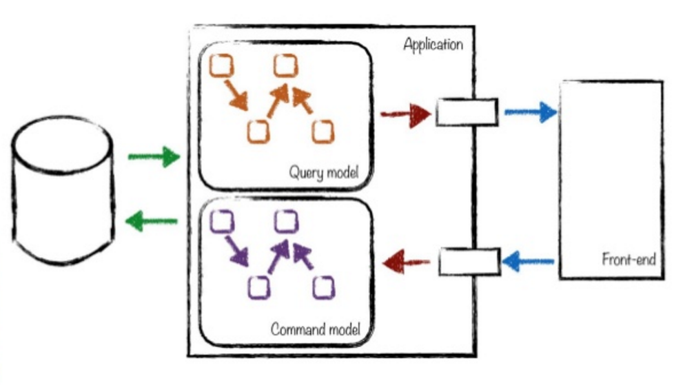

# Command Query Responsibility Segregation - CQRS

* Separate code for
  * Commands data (Writing)
  * Querying data (Reading)
* Message based via Queues.
* Eventual data consistency.

The pattern was originally described by [Greg Young](https://twitter.com/gregyoung) in 2011, but promoted by [Martin Folwer](https://martinfowler.com/bliki/CQRS.html) via his pattern and practices books. Its used in combination with [Domain Driven Design](https://en.wikipedia.org/wiki/Domain-driven_design) and [Event](https://martinfowler.com/eaaDev/EventNarrative.html) programming. The query side of the equation is designed for speed and often includes readonly sources or memory/cached versions of data that eventually become consistent. The Actor Model, defined in 1973 by Karl Hewitt, was added as the complimentary architecture by [Vaughn Vernon](https://vaughnvernon.co/).

**Messages** sent to queues are asynchronous, providing very fast processing of data changes.

* **Pro-Active** software architecture requires actively monitoring data state.
* **Reactive** software architecture, subscribes to state changes via Message events. Desirable feature.

## Not core features of CQRS

1. **Resiliency** - implementation strategy to resolve.
2. **Elastic** scaling up and down to meet demand is also part of the implementation strategy.

The pattern is just a guide, the implementation of CQRS is left up to the software engineer. It fits into a micro-services architecture and provides excellent starting points for [Service Reliability Engineering](https://en.wikipedia.org/wiki/Reliability_engineering).

## References

[Eventual Consistency Trade-Offs in Distributed Systems](https://www.ben-morris.com/eventual-consistency-and-the-trade-offs-required-by-distributed-development)

[Consistent, Available, Tolerant - CAP Theorem](https://en.wikipedia.org/wiki/CAP_theorem)

[CQRS Journey](https://www.slideshare.net/dhoerster/cqrs-evolved-cqrs-akkanet)

[CQRS Evolved with AKKA.net](https://www.slideshare.net/dhoerster/cqrs-evolved-cqrs-akkanet)

[Event Storming - 'What happened'](https://en.wikipedia.org/wiki/Event_storming)

[DevOps - Service Reliability Engineering](https://www.atlassian.com/incident-management/devops/sre)

[Akka.net - Actor Model framework](https://getakka.net/)

[Foundatio - Building Blocks for distributed applications](https://github.com/FoundatioFx/Foundatio)

[NServiceBus](https://particular.net/nservicebus)