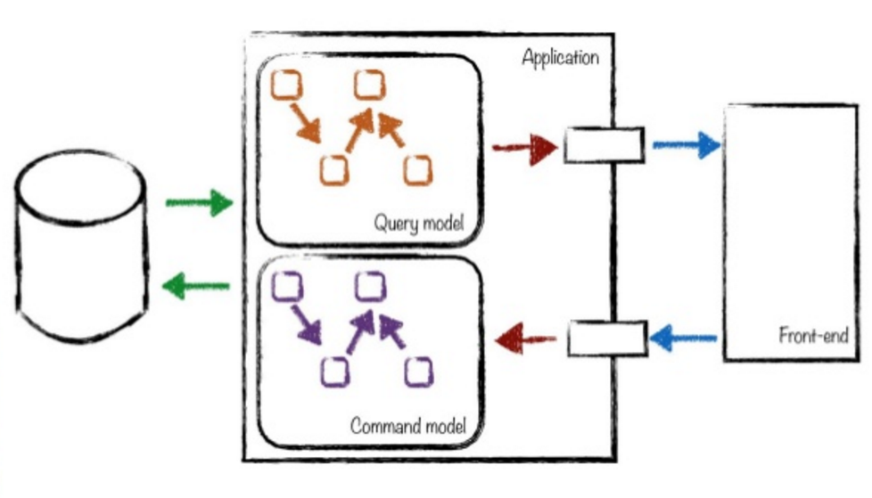

# Command Query Responsibility Segregation - CQRS



## Core Concept

CQRS separates **writing** (commands) from **reading** (queries) into distinct models, allowing each to scale and evolve independently.

- **Commands** mutate state (create, update, delete)
- **Queries** read state without side effects
- Communication is **asynchronous via message queues**, not direct method calls
- **Eventual consistency** means reads lag slightly behind writes

The pattern was originally described by [Greg Young](https://twitter.com/gregyoung) in 2011, but promoted by [Martin Fowler](https://martinfowler.com/bliki/CQRS.html) in his pattern and practices books. It's used in combination with [Domain Driven Design](https://en.wikipedia.org/wiki/Domain-driven_design) and [Event programming](https://martinfowler.com/eaaDev/EventNarrative.html).

## The Problem CQRS Solves

In traditional CRUD systems, the same data model handles both writes and reads:

```csharp
// Traditional: One model for read and write
public class Order
{
    public int Id { get; set; }
    public List<OrderLine> Lines { get; set; }  // Complex; used in writes
    public OrderStatus Status { get; set; }
    public DateTime CreatedAt { get; set; }
    public Customer Customer { get; set; }  // Heavy join; only needed for reads
    public List<PaymentHistory> Payments { get; set; }  // Audit trail; slows writes
}

// Write operation: Only needs Id, Lines, Status
// Read operation: Needs all fields plus joins
```

This creates tension:
- **Writes** want a normalized schema with referential integrity (slow)
- **Reads** want a denormalized schema with all data in one place (fast)

CQRS solves this by allowing each to have its own optimized model.

## Architecture

```
┌─────────────┐
│   Client    │
└──────┬──────┘
       │
       ├─────────────────────┬──────────────────────┐
       │                     │                      │
   [WRITE]              [READ]                  [QUERY]
       │                     │                      │
       ▼                     ▼                      ▼
┌──────────────┐    ┌────────────────┐    ┌──────────────┐
│ Command      │    │ Event Bus      │    │ Query Model  │
│ Handler      │    │ (RabbitMQ/     │    │ (Optimized   │
│              │    │  Kafka)        │    │  for reads)  │
└──────┬───────┘    └────────┬───────┘    └──────────────┘
       │                     │                      ▲
       ▼                     ▼                      │
┌──────────────┐    ┌────────────────┐             │
│ Write Model  │    │ Event Handler  │─────────────┘
│ (Normalized) │    │ (Updates read  │
│              │    │  model)        │
└──────────────┘    └────────────────┘
```

## Implementation Strategy

### Step 1: Identify Command and Query Models

**Command Model** - Optimized for writes:
- Normalized schema (3NF, BCNF)
- Enforces business rules and constraints
- Uses transactions to maintain consistency
- Example: Insert Order → OrderLines → OrderPayments with foreign keys

**Query Model** - Optimized for reads:
- Denormalized schema (often a flat table or document)
- Includes all fields needed by UI in one record
- No joins; reads are fast
- Example: OrderSummary table with customer name, total, status, etc.

### Step 2: Publish Domain Events

When a command completes, publish a domain event so other parts of the system react.

```csharp
// Command handler
public class CreateOrderCommandHandler
{
    public async Task Handle(CreateOrderCommand cmd)
    {
        // Write to command model
        var order = new Order { Id = cmd.OrderId, Status = "Created" };
        await _db.Orders.AddAsync(order);
        await _db.SaveChangesAsync();

        // Publish event
        await _eventBus.PublishAsync(new OrderCreatedEvent 
        { 
            OrderId = cmd.OrderId,
            CustomerId = cmd.CustomerId,
            Amount = cmd.Amount,
            CreatedAt = DateTime.UtcNow
        });
    }
}
```

### Step 3: Update Query Model Asynchronously

Event handlers subscribe to domain events and update the read model.

```csharp
// Event handler in a different service
public class OrderCreatedEventHandler : IEventHandler<OrderCreatedEvent>
{
    public async Task Handle(OrderCreatedEvent @event)
    {
        // Update query model (denormalized)
        var summary = new OrderQueryModel
        {
            OrderId = @event.OrderId,
            CustomerName = await _customerService.GetNameAsync(@event.CustomerId),
            Amount = @event.Amount,
            Status = "Created",
            CreatedAt = @event.CreatedAt
        };
        
        await _queryDb.OrderSummaries.AddAsync(summary);
        await _queryDb.SaveChangesAsync();
    }
}
```

### Step 4: Query the Read Model

Reads are fast because all data is already denormalized.

```csharp
// Query - super fast, no joins
public async Task<OrderQueryModel> GetOrderAsync(int orderId)
{
    return await _queryDb.OrderSummaries
        .FirstOrDefaultAsync(o => o.OrderId == orderId);
}
```

## Architectural Patterns

### Pro-Active vs Reactive

- **Pro-Active:** Client polls for data state (inefficient, creates load)
- **Reactive:** Client subscribes to state changes via events (desirable)

```csharp
// Pro-Active: Client asks "Is my order ready?"
public class OrderController
{
    [HttpGet("{id}")]
    public async Task<OrderStatus> GetStatus(int id)
    {
        return await _queryDb.OrderSummaries
            .Where(o => o.OrderId == id)
            .Select(o => o.Status)
            .FirstOrDefaultAsync();
    }
}

// Reactive: Client receives push notification
public class OrderStatusChangedEvent
{
    public int OrderId { get; set; }
    public OrderStatus NewStatus { get; set; }
}

// Client listens via SignalR or WebSocket
public class OrderHub : Hub
{
    public async Task SubscribeToOrderStatus(int orderId)
    {
        await Groups.AddToGroupAsync(Context.ConnectionId, $"order-{orderId}");
    }
}
```

## Trade-Offs and Considerations

### What CQRS Does NOT Guarantee

1. **Resiliency** - That's a separate concern (retries, timeouts, circuit breakers)
2. **Elastic scaling** - That's an implementation detail (Kubernetes, auto-scaling groups)

### Eventual Consistency Challenges

Eventual consistency means reads lag behind writes by seconds or minutes.

**Problem:** User creates an order, immediately queries for it, gets "not found."

**Solution:** Client-side UI hides the delay:
- Optimistic UI updates (show the order immediately while writing)
- Polling with backoff (retry if not found)
- Acknowledgment pattern (server responds with order ID, client queries later)

## When to Use CQRS

**Good fit:**
- Complex domain with many business rules (financial systems, insurance)
- Read and write volumes are vastly different (100K reads, 100 writes/second)
- Multiple services need to react to state changes
- You need audit trails and event sourcing

**Not a good fit:**
- Simple CRUD applications
- Strong consistency requirements (you need immediate reads after writes)
- Single-service applications (adds complexity without benefit)

## Common Frameworks

- **NServiceBus** - Enterprise service bus with CQRS support
- **MassTransit** - .NET service bus for microservices
- **Akka.NET** - Actor model framework for distributed CQRS
- **Foundatio** - Building blocks for distributed applications
- **Event Store** - Specialized database for event sourcing + CQRS

## Anti-Patterns to Avoid

**Anti-Pattern 1: Synchronous Commands and Queries**
```csharp
// DON'T: This defeats the purpose of CQRS
_queryModel.Update(cmd.Data);  // Synchronous write to read model
```

**Anti-Pattern 2: Sharing Command and Query Models**
```csharp
// DON'T: CQRS requires separate models
public class Order { /* 50 fields */ }  // Used for both reads and writes
```

**Anti-Pattern 3: Ignoring Eventual Consistency**
```csharp
// DON'T: Assume immediate consistency
await _commandBus.SendAsync(cmd);
var result = await _queryModel.GetAsync(...);  // May not exist yet!
```

## References

- [Eventual Consistency Trade-Offs in Distributed Systems](https://www.ben-morris.com/eventual-consistency-and-the-trade-offs-required-by-distributed-development)
- [Consistent, Available, Tolerant - CAP Theorem](https://en.wikipedia.org/wiki/CAP_theorem)
- [CQRS Journey](https://www.slideshare.net/dhoerster/cqrs-evolved-cqrs-akkanet)
- [CQRS Evolved with AKKA.net](https://www.slideshare.net/dhoerster/cqrs-evolved-cqrs-akkanet)
- [Event Storming - 'What happened'](https://en.wikipedia.org/wiki/Event_storming)
- [DevOps - Service Reliability Engineering](https://www.atlassian.com/incident-management/devops/sre)
- [Akka.NET - Actor Model framework](https://getakka.net/)
- [Foundatio - Building Blocks for distributed applications](https://github.com/FoundatioFx/Foundatio)
- [NServiceBus](https://particular.net/nservicebus)